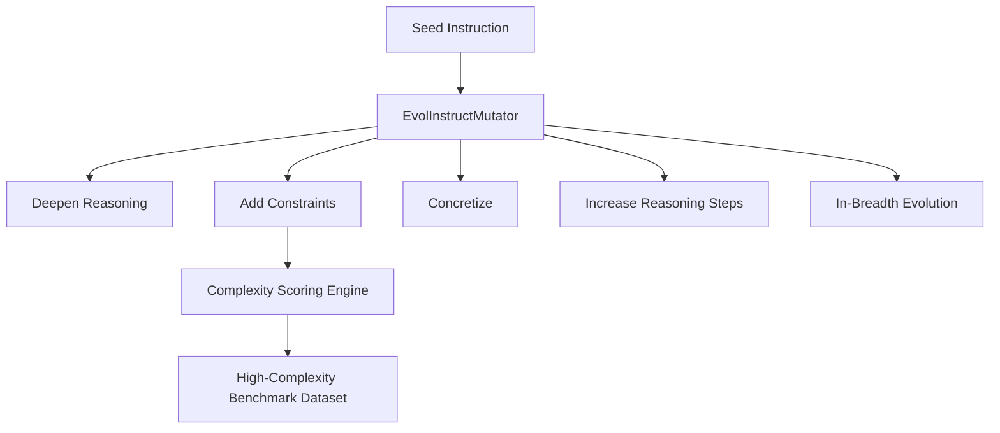

# genpark-evol-instruct-prompt-complexity-enhancer-skill

An algorithmic prompt mutation engine implementing the WizardLM Evol-Instruct paradigm. Synthesizes high-complexity training data from simple seed instructions through structured mutation templates.

## Architecture

## Features
- **Deterministic Complexity Scoring**: Quantifies lexical length, logical connectives, and constraints.
- **5 Mutation Vectors**: Deepens reasoning, adds technical constraints, concretizes abstract ideas, expands step count, and expands cross-domain analogies.
- **100% Python Standard Library**: Zero pip dependencies.
- **Model Context Protocol (MCP)**: Native stdio server support.
